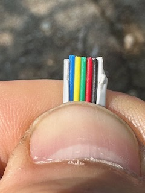

# Make your own USB to RS-232 Cable

The RS232 to USB cable has been discontinued by Renogy but it is relatively easy to make your own. This guide will show you how.

## Parts
- DB9 Breakout Connector
- USB to DB9 Serial Adapter
- RJ12 6P6C cable

## Assembly

The goal is to have a cable that connects to the RS-232 jack of the charge controller on one end and a USB-A port on the other end.

### RS-232

Starting with the RJ12 cable, make sure that this cable has a total of six cables in it (6P6C).

Cut one end of the RJ12 cable and remove about 1-2 inches of the exterior sheathing so that the internal wires are exposed.

You'll need to associate each color to the pins shown in the diagram below. Sometimes you can make out the color on the end with the plug which makes this a bit easier.

In the example above, the color to pin mapping looks like this:

| Pin # | Pin Description | Wire Color |
|--|--|--|
| 1 | TX | Blue |
| 2 | RX | Yellow |
| 3 | Ground | Green |
| 4 | Ground | Red |
| 5 | Power supply +12V | Black |
| 6 | Power supply -12V | White |

Make sure you get this mapping correct since connecting the 12V supply to the USB cable can damage your equipment.

If you have a multimeter, you can check the voltage of each wire to make sure you identified them correctly. Plug the cable into your charge controller and with your multimeter set to measure DC voltage:

- TX to ground: 5-6 volts
- TX to RX: 5-6 volts
- RX to ground: around ~0.1V

### DB9 Connector

With the wires properly identified, we can proceed to connecting them to the DB9 breakout connector. We'll only need the `TX`, `RX` and _one_ of the two `Ground` wires.

NOTE: I strongly suggest individually wrapping the other three wires with shrink tubing or electrical tape so that they don't accidentally connect.

The DB9 connector should have each pin well identified with numbers. You want to connect:

| RJ12 wire | DB9 Pin Number |
|--|--|
| TX | 2 |
| RX | 3 |
| Ground | 5 |

Close up the DB9 connector and that's basically it. You can now connect the DB9 connector to the USB/Serial cable which together gives you an RS-232 to USB cable!

# Special Thanks

Most of this guide is based on information from [this thread from the Renogy forum](https://renogy.boards.net/thread/535/using-rj11-cable-connect-raspberry).

